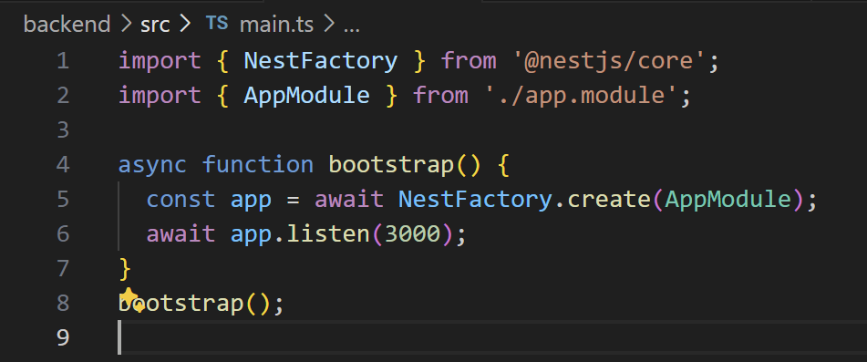
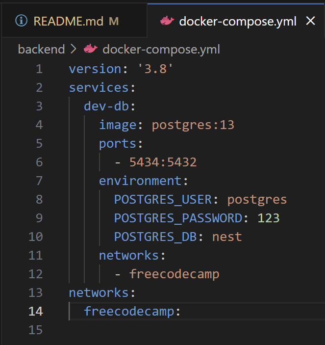
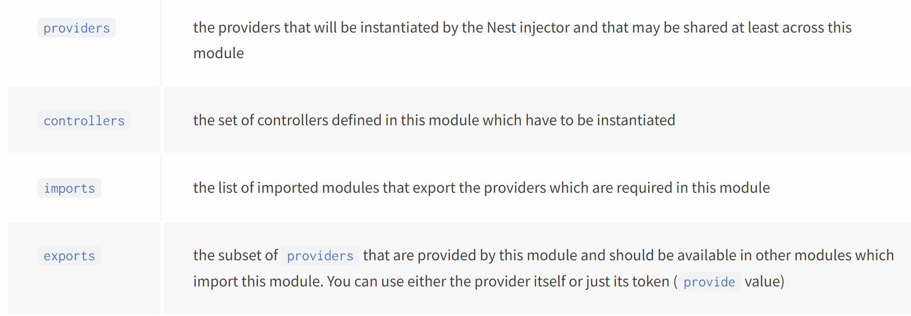

# what-is-Nestjs

1. [Getting Started](#getting-started)
   <br/> a. [PostgresSQL setup](#postgressql-setup)
2. [Basic Concepts](#basic-concepts)
   <br/>a. [Modules](#modules)
   <br/>b. [Pipes](#pipes)
   <br/>c. [Controllers](#controllers)

> Nestjs is a node.js backend framework built on top of Express with its strength in architecture.

Unlike **Express.js**, its lightweight counterpart which is unopinionated on how stuff should be structured, **Nestjs** aims to be a _platform-agnostic_ framework for building a _testable, scalable, and maintainable_ application through modularity.

---

## Getting Started

Run `npm i -g @nestjs/cli`, then create new project with `nest new [project_name]`

The initialization (termed _boostrap_) file can be found at `main.ts`, providing a HTTP listener at the specified port upon running `npm run start[:dev]` in terminal.



Data valiation libraries providing Pydantic functionalities: `yarn add class-validator class-transformer`

### PostgresSQL setup

We will configure `docker-compose.yml` to use multiple containers for the database, which will be available on port 5434.


To simplify development with the database, we will use **Prisma** for Object Relational Mapping (ORM) to enable programmatic interaction with the database through representations (objects & classes) rather than tedious queries. Install Prisma client by:

```command
yarn add -D prisma
yarn add @prisma/client

npx prisma init  # generate schema & default connection string in .env
```

The generated `schema.prisma` is where you declare the data representations. Remember to change the connection string with your credentials in `docker-compose.yml`. On running `npx prisma migrate dev`, the schema will be translated into SQL & **importable TypeScript types from "@prisma/client"** (recall _codegen_ for GraphQL)

---

## Basic Concepts

### Modules

> A module is any class annotated with the `@Module()` decorator which Nest uses to organize the application structure.
>  > _\* An application graph_

Each applciation has a root module contained in `app.module.ts` which encapsulates all modularized features. This composition is reminiscent of the one in React or Angular.

The module decorator accepts an object with the following keys (explained later on):

If other modules wish to use the provider of this module, then this module must export that provider (`exports: [ModuleService]`) **and** either:

1. Be imported by other modules.
2. Add the `@Global()` decorator to the provider and be imported by `app.module.ts`

You can handily generate a module and import it in `app.module.ts` using the command `nest g module [module]`. Module files by themselves do not contain the actual functionality. Instead, they are **containers** serving code organization and reusability.

### Pipes

> Pipes are injectable functions that serves to **transform and validate** data before a method is invoked

### Controllers

> Controllers are endpoints annotated by the decorator `@Controllers()` responsible for handling incoming requests & responses.
